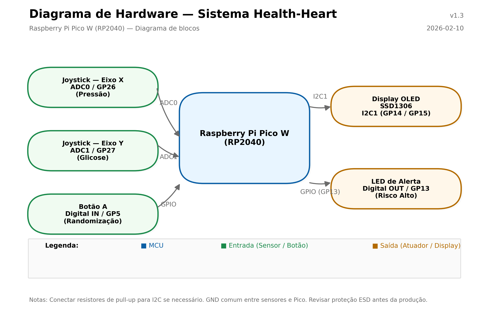

# 🧠 Health-Heart: Monitor de Risco Cardíaco com TinyML


Este projeto implementa um dispositivo de **Edge AI** capaz de estimar a probabilidade de risco de doença cardíaca coronariana em 10 anos. Utiliza a placa **BitDogLab (RP2040)** e executa um modelo TinyML (Rede Neural Densa) localmente.

O dispositivo funciona como um simulador médico: gera "pacientes virtuais" (dados demográficos e histórico) e permite que o usuário altere sinais vitais (Pressão e Glicose) em tempo real via joysticks, visualizando o risco instantâneo no display OLED.

---

## 🏗️ Arquitetura do Sistema

O fluxo de dados é inteiramente local (standalone). O firmware agrega as entradas, normaliza, passa o tensor ao interpretador TFLite Micro e executa a inferência no RP2040.

<div align="center">  </div>

---

## 📂 Estrutura do Repositório

```
.
├── CMakeLists.txt # Build: Pico SDK + TFLM + libs
├── health-heart.c # Código principal: hardware, UI e lógica
├── tinyml.cpp # Wrapper para TFLM (inicialização / inferência)
├── tinyml.h # Header do wrapper
├── model.h # Modelo convertido em array C
├── lib/ # Drivers e utilitários
│ ├── ssd1306.c
│ ├── ssd1306.h
│ └── font.h
├── pico-tflmicro/ # Submódulo: TensorFlow Lite Micro
└── Treinamento-Heart-Risk/ # Scripts e dados de treino
├── treinamento.py
└── framingham - pre processado.csv
```

---

## 🚀 Guia de Instalação e Uso

### Pré-requisitos

* **Hardware:** BitDogLab (RP2040) e cabo USB.
* **Toolchain:** Raspberry Pi Pico SDK, CMake, `arm-none-eabi-gcc`.
* **PC:** Python 3.8+ (opcional para logs/serial).

### 1. Compilar o firmware

```bash
git clone https://github.com/seu-usuario/health-heart.git
git submodule update --init --recursive
mkdir build && cd build
cmake -DPICO_BOARD=pico_w ..
make
```

O binário `health-heart.uf2` será gerado. Coloque a placa em modo BOOT (BOOTSEL) e copie o arquivo `.uf2` para a unidade montada.

### 2. Operação básica

* Ao ligar a placa, o firmware inicializa o modelo TinyML.
* Pressione **Botão A** para gerar um paciente virtual (os dados também são emitidos no monitor serial).
* Use o **Joystick X** para alterar a Pressão Sistólica (ADC0 / GP26).
* Use o **Joystick Y** para alterar a Glicose (ADC1 / GP27).
* O OLED mostra valores em tempo real e a barra de risco.
* Se **Risco > 30%**, o LED de alerta (GP13) acende e o display exibe **"PERIGO"**.

---

## ⚙️ Mapeamento de Pinos (Pinout)

> Mapeamento destinado à BitDogLab / RP2040 — ajuste conforme sua placa.

| Componente | Pino RP2040 | Função         |
| ---------- | ----------- | -------------- |
| Joystick X | GP26        | ADC0 - Pressão |
| Joystick Y | GP27        | ADC1 - Glicose |
| Botão A    | GP5         | Digital IN     |
| OLED SDA   | GP14        | I2C SDA        |
| OLED SCL   | GP15        | I2C SCL        |
| LED Alerta | GP13        | Digital OUT    |

---

## 🧠 Detalhes do Modelo TinyML

* **Treinamento:** Keras/TensorFlow (Google Colab). Dataset: Framingham Heart Study (~4k amostras).
* **Features (15):** Sexo, Idade, Educação, Fumante, Cigarros/dia, Meds BP, AVC, Hipertensão, Diabetes, Colesterol, PA Sistólica, PA Diastólica, IMC, Batimentos, Glicose.
* **Arquitetura:** Dense(16, ReLU) → Dense(8, ReLU) → Dense(1, Sigmoid).
* **Tamanho:** ~3 KB (flash). Arena reservada: ~6 KB.
* **Ops incluídas no resolver:** FullyConnected, Relu, Logistic (Sigmoid), Quantize/Dequantize (se aplicável).

---

## 🛠️ Troubleshooting (Solução de Problemas)

| Problema          | Possível Causa                      | Solução                                                  |
| ----------------- | ----------------------------------- | -------------------------------------------------------- |
| OLED apagado      | I2C sem pull-ups ou endereço errado | Verifique conexões 14/15 e endereço 0x3C                 |
| Build falha       | Include/CMake faltando              | Confirme `CMakeLists.txt` e diretórios `lib/`            |
| Risco constante   | MEAN/STD inconsistentes             | Atualize constantes de normalização conforme treinamento |
| Modelo não inicia | Arena pequena                       | Aumente `kTensorArenaSize` em `tinyml.cpp` (ex.: 10KB)   |

---

## 📜 Licença

Projeto para fins educacionais. Repositório licenciado com **MIT License**.

---
